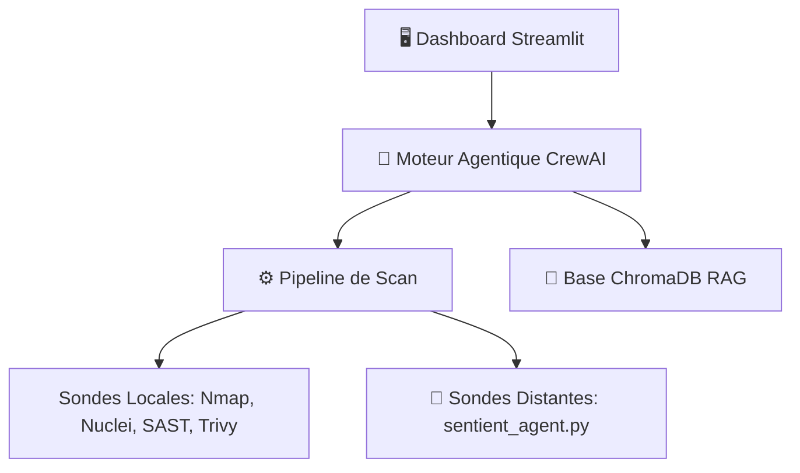

# 📖 Documentation de Référence : Sentient AI

Ce document présente un guide complet d'utilisation, de configuration et d'intégration de **Sentient AI**, la plateforme d'audit de sécurité automatisée (PTaaS) propulsée par l'intelligence artificielle locale.

---

## 🗺️ Table des Matières
1. [Architecture & Concept Cible](#1-architecture--concept-cible)
2. [Déploiement & Installation](#2-déploiement--installation)
3. [Guide d'Utilisation des Scans Réseau & Web](#3-guide-dutilisation-des-scans-réseau--web)
4. [Sécurité DevSecOps (SAST & Trivy)](#4-sécurité-devsecops-sast--trivy)
5. [Audits Système & Élévation de Privilèges (LPE)](#5-audits-système--élévation-de-privilèges-lpe)
6. [Le Coffre à PoC & Détection (Vérification Passive)](#6-le-coffre-à-poc--détection-vérification-passive)
7. [Analyse Risque ROI, RAG & Planificateur](#7-analyse-risque-roi-rag--planificateur)
8. [Intégrations CI/CD, Ticketing & Partage](#8-intégrations-cicd-ticketing--partage)
9. [Configuration Avancée & Personnalisation (White-Label)](#9-configuration-avancée--personnalisation-white-label)
10. [FAQ & Résolution des Problèmes (Troubleshooting)](#10-faq--résolution-des-problèmes-troubleshooting)

---

## 1. Architecture & Concept Cible

Sentient AI combine des scanners traditionnels éprouvés et des agents d'intelligence artificielle locale pour automatiser la chaîne d'audit cyber sans compromettre la confidentialité des données (100% On-Premise).



### Les Agents IA Déployés (CrewAI + Ollama)
* **Analyste SOC Senior (SOC Analyst)** : Analyse les vulnérabilités brutes, évalue leur sévérité contextuelle et élimine les faux positifs.
* **Lead Pentester (Reporter)** : Rédige le rapport d'audit au format Markdown en traduisant les résultats bruts en recommandations exploitables.
* **Exploit Validator** : Évalue la possibilité de concevoir un vecteur de validation inoffensif pour confirmer la faille.
* **Blue Team Defender** : Conçoit les règles de remédiation technique (WAF, pare-feu, signatures Yara).
* **Traducteur Cyber (Translator)** : Traduit les rapports terminés dans les langues sélectionnées (FR, EN, ES, DE) sans altérer les structures techniques.

---

## 2. Déploiement & Installation

### Option A : Déploiement Docker Compose (Recommandé)
Docker Compose encapsule toutes les dépendances (Python, Nmap, Nuclei, Trivy, Semgrep, etc.) et configure Ollama de manière isolée.

1. Créez les fichiers persistants vides sur l'hôte :
   ```bash
   touch audits.db report_config.json
   ```
2. Démarrez l'orchestration :
   ```bash
   docker compose up -d --build
   ```
3. Accédez à l'interface Streamlit sur `http://localhost:8501`.

### Option B : Script TUI Interactif (`install.sh`)
Exécutez l'installateur interactif en ligne :
```bash
curl -sL https://raw.githubusercontent.com/magasword22/sentient-ai/main/install.sh | bash
```
Ce script détectera votre système d'exploitation, votre architecture (Intel/AMD/ARM) et configurera le GPU Nvidia (CUDA) ou AMD (ROCm) pour accélérer la génération IA.

---

## 3. Guide d'Utilisation des Scans Réseau & Web

### Configuration du Périmètre
1. Accédez à l'onglet **⚡ Lancer un Audit**.
2. Renseignez la cible sous forme d'adresse IP, plage CIDR, ou nom de domaine (ex: `192.168.1.0/24` ou `target.local`).
3. Sélectionnez le **Mode Nmap** :
   - *Aucun* : Scan Nuclei direct.
   - *Rapide* : Scan d'hôte ping basique.
   - *Standard* : Scan des 1000 ports les plus fréquents.
   - *Aggressif* : Scan complet avec détection d'OS et de versions (`-O -sV`).

### Évasion de Pare-feu & Authentification
* **Fragmentation (`-f`)** : Scinde les paquets réseau pour contourner la détection de signatures par les pare-feux/IDS.
* **Leurres (`-D`)** : Simule des requêtes réseau provenant d'adresses factices pour masquer l'IP de la sonde.
* **Usurpation MAC** : Permet de falsifier l'adresse matérielle réseau de la sonde d'audit.
* **Scans Authentifiés** : Fournissez des Cookies de session ou des en-têtes HTTP (ex: `Authorization: Bearer <token>`) pour auditer les routes web protégées.

---

## 4. Sécurité DevSecOps (SAST & Trivy)

Sentient AI intègre des modules d'analyse de code et d'images de conteneur pour sécuriser la chaîne d'intégration continue.

### Analyse Statique (SAST)
* **Usage** : Cochez l'option *SAST* et renseignez le chemin local du code source (ex: `/src/app`).
* **Moteurs** : `Semgrep` (analyse structurelle multilingue) et `Bandit` (analyse de vulnérabilités spécifiques à Python) s'exécutent pour détecter des injections SQL, secrets codés en dur ou mauvaises pratiques.

### Audit de Conteneurs (Trivy)
* **Usage** : Renseignez le nom de l'image de conteneur (ex: `nginx:alpine`) ou le dossier racine d'un conteneur à auditer.
* **Détection** : Trivy identifie les paquets OS obsolètes, les failles de bibliothèques et les configurations Docker non sécurisées.

---

## 5. Audits Système & Élévation de Privilèges (LPE)

Cette fonctionnalité permet de connecter Sentient AI à une machine cible via SSH afin d'analyser la surface d'attaque locale et de détecter les vecteurs d'élévation de privilèges (LPE).

### Informations Collectées et Analysées

| Système | Éléments Audités | Objectif Sécurité |
| :--- | :--- | :--- |
| **Linux** | Binaires SUID/SGID, capabilities Linux, socket Docker accessible, historique Bash/Zsh, configurations Sudo sans mot de passe, version de noyau (Kernel). | Identification de vulnérabilités locales majeures (PwnKit, Dirty Pipe, etc.). |
| **macOS** | Statut du SIP (System Integrity Protection), droits d'accès TCC, configurations Sudo, paquets Homebrew obsolètes, fichiers de config sensibles. | Durcissement de l'hôte et détection de mauvaises configurations de privilèges. |
| **Windows** | Clés AlwaysInstallElevated dans le Registre, Unquoted Service Paths, correctifs de sécurité (Hotfixes), secrets Winlogon (Autologon), PowerShell history. | Identification de chemins de privilèges système défaillants. |

### Déroulement de l'Audit local
1. Renseignez l'IP, le nom d'utilisateur SSH et le mot de passe (ou téléversez la clé privée SSH).
2. Cliquez sur **Exécuter l'audit système**.
3. Sentient AI exécute un collecteur léger non destructif [host_auditor.py](file:///home/magsword22/sentient/sentient-ai/host_auditor.py) adapté à l'OS cible.
4. Les données brutes structurées sont passées à une CrewAI dédiée enrichie par notre référentiel vectoriel local RAG ([standards/kernel_exploits.md](file:///home/magsword22/sentient/sentient-ai/standards/kernel_exploits.md)).
5. Un rapport d'audit interne complet avec des playbooks de remédiation est généré.

---

## 6. Le Coffre à PoC & Détection (Vérification Passive)

L'onglet **🧪 Coffre à PoC & Détection** permet de générer de manière sécurisée des vérificateurs de vulnérabilités.

### Fonctionnement
* **Saisie** : Entrez un identifiant de vulnérabilité standardisé (ex: `CVE-2021-44228`).
* **Analyse IA** : Sentient AI consulte ses connaissances et propose une description détaillée ainsi qu'un script de détection entièrement **passif et inoffensif** (ex: vérification de version de bibliothèque ou de clé de registre).
* **Sécurité** : La génération interdit strictement les charges utiles actives (reverse shell, injection destructive) conformément aux normes éthiques de l'outil.
* **Téléchargement** : Le script résultant (Python `.py` ou Bash `.sh`) est téléchargeable en un clic pour vos tests d'audit.

---

## 7. Analyse Risque ROI, RAG & Planificateur

### Calculateur de Risque Financier (ROI)
L'outil calcule l'exposition financière totale associée aux vulnérabilités selon le secteur d'activité, la taille de l'entreprise et la sensibilité des données.
* Il compare le coût estimé d'une violation de données (NIS 2 / RGPD) face au coût de remédiation technique, affichant un indicateur de ROI pour aider à la prise de décision.

### Base de Connaissances (RAG)
Sentient AI utilise la base vectorielle ChromaDB pour contextualiser les analyses de l'IA.
* **Ingestion** : Téléversez des documents PDF ou Markdown dans l'onglet *Base de Connaissances*.
* **Standards Pré-intégrés** : L'onglet propose d'indexer en un clic les guides ANSSI, les benchmarks de sécurité CIS et le guide des exploits noyau de Sentient AI.

### Planificateur d'Audits Récurrents
Planifiez des scans quotidiens, hebdomadaires ou mensuels sur vos cibles. Un service d'arrière-plan permanent SQLite surveille les tâches programmées et exécute automatiquement les audits, envoyant des rapports d'alerte en cas d'apparition de failles de sévérité élevée.

---

## 8. Intégrations CI/CD, Ticketing & Partage

### Connecteurs de Ticketing
Après chaque audit, vous pouvez exporter instantanément les vulnérabilités vers :
* **Jira** (génération de tickets de correctif).
* **GitHub Issues** & **GitLab Issues** (assignation des anomalies aux développeurs).

### Liens de Partage Temporaires
Générez des liens chiffrés expirants vers les rapports PDF/Markdown hébergés localement. Ces liens permettent à des tiers (clients, directeurs) de lire le rapport en mode lecture seule sans nécessiter de compte d'administration sur le portail principal.

### Intégration CI/CD avec le CLI
Utilisez le script [sentient_cli.py](file:///home/magsword22/sentient/sentient-ai/sentient_cli.py) au sein de vos pipelines de build (GitLab CI / GitHub Actions) :
```bash
# Export au format standard SARIF pour GitHub Security Center
python3 sentient_cli.py --target ./src-code --sast --format sarif --output results.sarif
```

---

## 9. Configuration Avancée & Personnalisation (White-Label)

### Rapports White-Label (Marque Blanche)
Personnalisez les livrables PDF destinés à vos clients depuis l'onglet **Configuration** :
* Téléversez le logo de votre cabinet d'audit.
* Saisissez le nom de votre entreprise et personnalisez le texte de pied de page.
* Définissez le code couleur CSS de votre marque (couleur primaire, secondaire).

### Thèmes de l'Interface Web
Basculez à tout moment l'interface Streamlit entre trois esthétiques distinctes :
1. **Slate/Zinc** : Sombre, épuré et moderne.
2. **Light/Clean** : Clair, parfait pour la lisibilité professionnelle.
3. **Matrix/Hacker** : Thème vintage vert et noir inspiré des terminaux de sécurité.

---

## 10. FAQ & Résolution des Problèmes (Troubleshooting)

### Q : Le conteneur Ollama consomme 100% de mon processeur et est très lent.
* **R** : Par défaut, Ollama s'exécute sur CPU. Assurez-vous d'avoir configuré l'accélération matérielle. Pour les GPU AMD, vérifiez que le périphérique `/dev/kfd` et `/dev/dri` est bien monté dans le fichier `docker-compose.yml` et que la variable `HSA_OVERRIDE_GFX_VERSION` correspond à votre génération de puce.

### Q : La connexion SSH vers ma cible Windows échoue.
* **R** : Vérifiez que le service OpenSSH est bien démarré sur Windows et que l'utilisateur dispose des privilèges requis pour l'exécution à distance de scripts PowerShell (Bypass ExecutionPolicy).

### Q : Où sont stockés mes rapports d'audits ?
* **R** : Tous les rapports (PDF et Markdown) sont persistés localement dans le dossier `reports/` de l'application et enregistrés dans la base SQLite locale `audits.db`.
