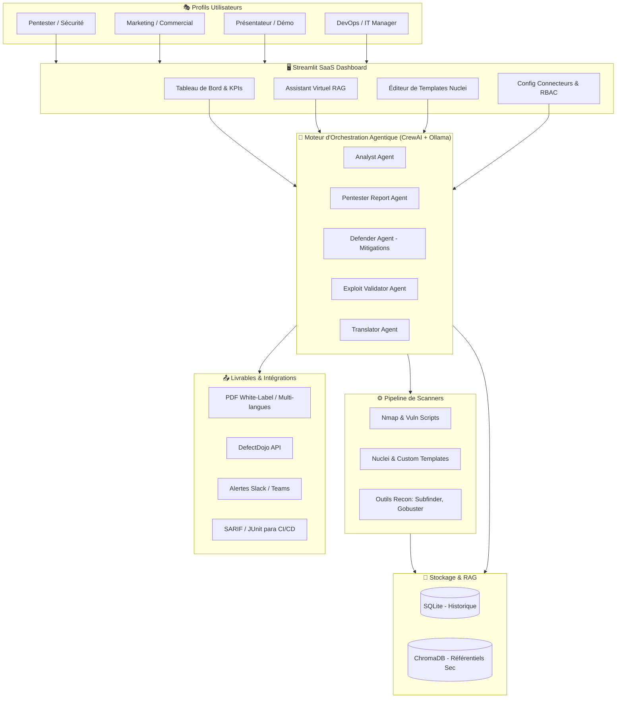

# 📋 Feuille de Route & To-Do List : Sentient AI

Ce document présente la vision globale, la feuille de route détaillée et le suivi des évolutions de **Sentient AI** (moteur PTaaS 100% local), adaptées aux besoins des pentesters, du marketing, des présentateurs, et des DevOps.

---

## 🗺️ Vision Globale de l'Architecture Cible

Pour soutenir ces nouvelles fonctionnalités, voici le schéma de l'architecture modulaire proposée :



---

## 🛠️ Évolutions par Profils Utilisateurs

### 1. Pour les Pentesters & Équipes de Sécurité
Les experts en cybersécurité recherchent la flexibilité technique, la précision du scan et le contrôle total du comportement des agents IA.

| Fonctionnalité | Description | Impact Technique | Statut |
| :--- | :--- | :--- | :---: |
| **Sélections de Vulnérabilités Avancées** | Configuration dynamique des types de scans depuis le menu Audit (RCE, injections, SSL/TLS, DNS, default-logins, etc.). | Cartographie directe des tags Nuclei en cours d'exécution. | 🟢 **Implémenté** |
| **Pipeline de Reconnaissance Étendu** | Intégration d'outils DNS et de fuzzing en amont : `Subfinder`, `Amass`, et `Gobuster`/`ffuf`. | Augmente la surface d'attaque identifiée avant l'évaluation. | 🟢 **Implémenté** |
| **Éditeur de Templates Nuclei Intégré** | Interface web avec coloration syntaxique permettant d'écrire, modifier et tester des templates YAML. | Permet de cibler des vulnérabilités propriétaires internes. | 🟢 **Implémenté** |
| **Agent de Validation d'Exploits** | Agent CrewAI spécialisé ("Exploit Validator") exécutant des PoC non destructives pour valider les failles. | Réduction à 0% du taux de faux positifs. | 🟢 **Implémenté** |
| **Agent Défensif (Blue Team Companion)** | Agent générant des correctifs automatisés (ModSecurity WAF, configurations Nginx, règles de pare-feu, Yara). | Génère un guide de remédiation technique immédiat. | 🟢 **Implémenté** |
| **Techniques d'Évasion de Pare-feu** | Options Nmap : fragmentation de paquets (`-f`), leurres (`-D`), usurpation MAC. | Permet d'évaluer la résilience des pare-feux et IDS/IPS clients. | 🟢 **Implémenté** |

> [!TIP]
> **Sécurité locale accrue :** Toutes ces opérations de validation d'exploits s'effectuent via l'instance Ollama locale, garantissant qu'aucune donnée de faille zero-day ne fuite vers des API tierces.

---

### 2. Pour le Marketing & les Équipes Commerciales
Le marketing et les commerciaux ont besoin de livrables esthétiques, valorisants pour leur marque, et de métriques d'impact pour convaincre les décideurs.

| Fonctionnalité | Description | Impact Business | Statut |
| :--- | :--- | :--- | :---: |
| **Rapports White-Label (Marque Blanche)** | Téléversement de logo, palettes CSS de couleurs personnalisées, en-têtes et pieds de page PDF. | Permet aux cabinets et MSSP de revendre des rapports sous leur propre marque. | 🟢 **Implémenté** |
| **Calculateur de Risque Financier (ROI)** | Tableau de bord estimant l'impact financier brut (sectoriel, RGPD, NIS 2) face au coût de remédiation. | Argumentaire financier direct auprès des directions générales (C-Level). | 🟢 **Implémenté** |
| **Badges de Conformité Réglementaire** | Cartographie automatique aux frameworks : ISO 27001, SOC2, PCI-DSS et ANSSI. | Donne un aperçu instantané de la préparation à une certification. | 🟢 **Implémenté** |
| **Traduction Automatique des Rapports** | Agent de traduction pour générer les rapports en plusieurs langues (EN, FR, ES, DE). | Facilite le business international et les filiales mondiales. | 🟢 **Implémenté** |
| **Liens de Partage Sécurisés Temporaires** | URL sécurisée, chiffrée et expirante hébergeant une version interactive en lecture seule du rapport. | Évite le partage de documents sensibles par courriel non sécurisé. | 🟢 **Implémenté** |

---

### 3. Pour les Présentateurs, Démos & Avant-Vente
Ces fonctionnalités visent à maximiser l'effet "Wow" lors de démonstrations en direct tout en éliminant les aléas techniques du direct.

```
       🎨 Thème Cyberpunk / High-Tech
                    │
                    ▼
 🛡️  [Mode Démo Instantané (Simulation)] ──► ⚡ Zéro attente réseau (Cibles fictives)
                    │
                    ▼
       📊 Visualiseur de Pensée IA en Live
```

* **Mode Démo Instantané (Simulation)** : [🟢 **Implémenté**]
  * Un bouton permettant de lancer un scan simulé ultrarapide sur une cible fictive (`target.demo`). Le système charge instantanément des résultats prédéfinis de vulnérabilités critiques (ex: Log4j, fuites de clés API) et lance l'IA pour générer le rapport en direct.
  * **Intérêt** : Évite les temps d'attente d'un scan réseau réel (qui peut prendre de 10 à 30 minutes) pendant une présentation de 5 minutes devant un client.
* **Visualiseur Graphique des Agents (Thought Stream)** : [🟢 **Implémenté**]
  * Un composant visuel dynamique (graphe ou bulles de discussion animées) montrant les interactions en temps réel entre l'analyste SOC et le Lead Pentester. L'utilisateur voit l'IA "réfléchir", faire des recherches web et débattre de la sévérité d'une faille.
  * **Intérêt** : Rend l'intelligence artificielle agentique tangible et captivante pour l'audience.
* **Moniteur de Performance Matérielle (GPU Telemetry)** :
  * Affichage en temps réel de la charge CPU/GPU, VRAM et de la vitesse de génération (tokens/seconde). [🟢 **Implémenté**]
* **Personnalisation des Thèmes d'Interface (UI)** :
  * Un sélecteur de thèmes dans l'onglet configuration (Slate/Zinc, Light/Clean, Matrix/Hacker). [🟢 **Implémenté**]

---

### 4. Pour les Développeurs, DevOps & Administrateurs
Ce profil recherche la facilité de déploiement, l'automatisation et l'intégration dans des architectures existantes.

1. **Architecture Distribuée (Agents Distants)** : [🟢 Implémenté]
   * Permettre à Sentient AI de déployer des conteneurs légers de scan (sondes Nmap/Nuclei uniquement) sur des serveurs distants ou des VPS, puis de renvoyer les fichiers JSON bruts au serveur central pour l'analyse IA.
   * *Bénéfice* : Permet d'auditer des réseaux internes segmentés sans y installer tout le moteur IA.
2. **Playbooks de Remédiation Automatique** : [🟢 Implémenté]
   * En plus d'expliquer comment corriger une faille, l'assistant virtuel propose des boutons pour télécharger des scripts d'automatisation de correctifs : playbooks **Ansible**, scripts **Bash**, configurations **Terraform**, ou correctifs de fichiers **Dockerfile**.
3. **Intégration CI/CD Native (DevSecOps)** : [🟢 Implémenté]
   * Lancement en mode ligne de commande standardisé (`sentient scan --target target.com --format sarif`) pour intégrer les résultats dans les onglets de sécurité de GitHub, GitLab ou SonarQube.
4. **Planificateur de Scans Récurrents (Cron)** : [🟢 Implémenté]
   * Planifier des audits automatiques réguliers (toutes les nuits, toutes les semaines) sur un périmètre donné. Le système envoie une alerte Slack/Discord/E-mail uniquement si de nouvelles failles d'une sévérité critique ou haute sont découvertes.
5. **Authentification & Contrôle d'Accès (RBAC)** : [🟢 Implémenté]
   * Protection de l'interface Streamlit par une couche d'authentification (compatible LDAP, OAuth2/OIDC, ou gestion locale SQLite) avec des rôles définis (ex: *Admin* pour lancer les scans, *Client* pour uniquement consulter les rapports dans le coffre-fort).
6. **Lancement unifié Docker Compose (One-Click)** : [🟢 Implémenté]
   * Fournir un fichier `docker-compose.yml` orchestrant l'application Streamlit et une instance Ollama pré-configurée avec prise en charge du GPU pass-through (CUDA/ROCm/Vulkan).
   * *Bénéfice* : Déploiement instantané sans aucune dépendance Python ou système.
7. **TUI d'installation interactive (terminal menu)** :
   * Mettre à niveau `install.sh` avec une interface TUI interactive (ex: via `dialog`) pour choisir les options d'installation, la taille du LLM par défaut et les configurations réseaux (reverse proxy).
   * *Bénéfice* : Améliore radicalement l'expérience de l'administrateur lors de l'installation.
8. **Optimisation Matérielle Dynamique (Hardware Tuning)** :
   * Profilage automatique de la RAM, VRAM et CPU lors du premier démarrage pour configurer de manière optimale le nombre de threads d'Ollama et les limites concurrentes de scan Nuclei.
   * *Bénéfice* : Vitesse de réponse IA et de scan maximisée sans configuration manuelle.
9. **Infrastructure-as-Code (Terraform & Ansible)** :
   * Fournir des templates Terraform et playbooks Ansible pour provisionner et configurer automatiquement des serveurs d'audit cyber dédiés sur AWS, GCP, Azure ou Scaleway en 3 minutes.
   * *Bénéfice* : Automatisation du cycle de vie des serveurs d'audit (Infrastructure immutable).
10. **Chart Helm Kubernetes Enterprise** :
    * Créer un Helm Chart complet pour déployer Sentient AI sur des clusters Kubernetes d'entreprise avec gestion des volumes persistants pour l'historique et intégration des secrets.
    * *Bénéfice* : Intégration cloud native simplifiée pour les grandes architectures.

---

## 📊 Matrice d'Impact vs Effort de Développement

| Catégorie | Fonctionnalité clé | Effort estimé | Impact perçu | Priorité recommandée |
| :--- | :--- | :--- | :--- | :---: |
| **Démos / Présentateurs** | Mode Démo (Simulation instantanée) | 🟢 Faible | 🔴 Très Élevé | **Haute** |
| **Sécurité / Pentest** | Agent de validation d'exploits (PoC) | 🟡 Moyen | 🔴 Très Élevé | **Haute** |
| **Développeurs / DevOps**| Déploiement Docker Compose unifié | 🟢 Faible | 🔴 Très Élevé | **Haute** |
| **Marketing / Sales** | Rapports PDF personnalisés (White-Label) | 🟢 Faible | 🟡 Moyen | **Moyenne** |
| **Développeurs / DevOps**| Planificateur de scans (Cron) | 🟡 Moyen | 🟡 Moyen | **Moyenne** |
| **Sécurité / Pentest** | Agent de mitigation défensive | 🟡 Moyen | 🟡 Moyen | **Moyenne** |
| **Développeurs / DevOps**| TUI d'installation pour install.sh | 🟡 Moyen | 🟡 Moyen | **Moyenne** |
| **Développeurs / DevOps**| Optimisation matérielle dynamique | 🟡 Moyen | 🟡 Moyen | **Moyenne** |
| **Développeurs / DevOps**| Infrastructure-as-Code (Terraform) | 🟡 Moyen | 🟡 Moyen | **Moyenne** |
| **Développeurs / DevOps**| Chart Helm Kubernetes | 🟡 Moyen | 🟡 Moyen | **Moyenne** |
| **Développeurs / DevOps**| Architecture de scan distribuée | 🔴 Élevé | 🟡 Moyen | **Basse** |

---

## 📋 Suivi Détaillé des Tâches (To-Do List)

### 1. 🧠 Modèles & Intelligence IA
- [x] **Moteur d'IA Hybride (Local + API Cloud)** : Ajouter une option dans la configuration pour basculer vers des API distantes (OpenAI GPT-4o, Anthropic Claude 3.5 Sonnet, Groq) en cas de besoin de performances ou de rapidité.
- [x] **RAG Étendu & Référentiels Cyber** : Vectoriser et intégrer les guides de l'ANSSI, les benchmarks CIS et les documentations de remédiation OWASP dans la base vectorielle locale (ChromaDB) pour enrichir le contexte de l'IA.

### 2. ⚡ Capacités de Scan & Sécurité
- [x] **Sélections avancées de vulnérabilités** : Formulaire à checkboxes 3 colonnes mappé sur les tags Nuclei (`rce`, `sqli`, `xss`, etc.).
- [x] **Scans Authentifiés** : Implémenter la prise en charge d'identifiants (clés SSH, tokens d'API, cookies de session web) dans `scanner.py` pour réaliser des scans internes en profondeur.
- [x] **Intégration SAST & Conteneurs (DevSecOps)** :
  - [x] Intégrer `Trivy` pour l'analyse de vulnérabilités dans les images Docker et conteneurs.
  - [x] Intégrer `Semgrep` ou `Bandit` pour le scan de vulnérabilités directement dans le code source de l'organisation.

### 3. 📅 Automatisation, Planification & Alertes
- [x] **Planificateur d'Audits Récurrents (Cron)** : Ajouter un module de planification dans l'interface Streamlit permettant d'automatiser des scans réguliers (quotidiens, hebdomadaires, mensuels).
- [x] **Notifications & Alertes Temps Réel** : Mettre en œuvre des connecteurs webhook pour envoyer des alertes instantanées sur Slack, Microsoft Teams, Discord ou par e-mail en cas de détection d'une vulnérabilité critique.

### 4. 🛠️ Correction Assistée & Connexions DevOps
- [x] **Génération Automatisée de Scripts de Remédiation** : Permettre à l'IA d'éditer ou de proposer au téléchargement des scripts prêts à l'emploi (playbooks Ansible, configurations Terraform, correctifs de fichiers Dockerfile, règles de pare-feu).
- [x] **Intégration d'outils de ticketing** : Ajouter des boutons dans le rapport ou l'assistant virtuel pour pousser automatiquement les vulnérabilités détectées sous forme de tickets Jira ou de GitLab/GitHub Issues.

### 5. 📊 Rapports & Conformité Business
- [x] **Rapports White-Label** : Personnalisation de logo, couleurs et nom de marque.
- [x] **Justifications Réglementaires & ROI** : Mentions DORA/NIS 2/RGPD, calculs financiers ROI et outil de simulation interactif.
- [x] **Traduction automatique** : Permettre la génération instantanée de rapports PDF en anglais, espagnol, allemand, etc. à l'aide d'agents de traduction IA.

### 6. 📦 Déploiement, DevOps & Facilité d'Installation
- [x] **Déploiement Docker Compose** : Écrire un fichier `docker-compose.yml` multi-conteneurs avec intégration automatique d'Ollama et de l'application avec accélération matérielle.
- [x] **TUI (Text User Interface) d'installation** : Moderniser `install.sh` avec un menu terminal interactif pour guider l'utilisateur.
- [x] **Optimisation matérielle automatique** : Profiler le système (RAM/VRAM/GPU) pour auto-configurer Ollama et les taux de threads de Nuclei.
- [x] **Templates Terraform & Ansible (IaC)** : Développer des scripts pour instancier des instances d'audit dédiées dans le Cloud en quelques clics.
- [x] **Chart Helm Kubernetes** : Concevoir les fichiers de configuration Kubernetes Helm pour le déploiement en entreprise.

### 7. 🖥️ Audit Système & Élévation de Privilèges (LPE / PrivEsc)
- [x] **Script de Collecte Interne Distant** : Exécuter par SSH un script de reconnaissance des vulnérabilités locales (SUID/SGID, version du Kernel, règles Sudo sans mot de passe).
- [x] **Collecte Avancée de Vecteurs d'Attaque** : Auditer les Linux Capabilities, les ports locaux à l'écoute, l'accès au socket Docker, les variables d'environnement exposant des identifiants et l'historique shell.
- [x] **Orchestration Multi-Agents Dédiée (LPE)** : Lancer une équipe CrewAI distincte (Spécialiste PrivEsc + Rapporteur d'Audit) pour évaluer les données système brutes.
- [x] **Rapports d'Audit Interne Détaillés** : Exporter les rapports système d'audit local en formats Markdown et PDF interactifs via l'interface et le coffre-fort de rapports.

### 8. 🛡️ Détections Extrêmes ( Roadmap 2026 - Détection de Failles Avancées )
- [x] **Chasse aux Identifiants & Mots de Passe Résiduels** : Scans récursifs approfondis des dossiers de configuration, de l'historique des commandes, des bases de données de navigateurs et des registres de configuration pour identifier des identifiants en clair et des mots de passe par défaut.
- [x] **Audit de Segmentation Réseau Multi-Points** : Comparer la visibilité réseau depuis l'extérieur (scan Nmap standard) avec des sondes internes (scans locaux) pour détecter automatiquement les défauts de cloisonnement ou de segmentation réseau.
- [x] **Corrélation Automatique des CVE de Noyau (Kernel LPE)** : Analyse des versions exactes de Noyau et distribution (Linux, macOS, Windows) croisées avec une base d'exploits RAG pour répertorier l'ensemble des vulnérabilités critiques d'élévation de privilèges applicables.
- [x] **Audit Continu des Mises à Jour Logicielles (Patch Management)** : Collecter la liste complète des dépendances et paquets installés (Pip, Npm, Apt, Brew, etc.) et interroger les référentiels de sécurité locaux pour lister les vulnérabilités non corrigées et les mises à jour de sécurité manquantes.
- [x] **Vérification d'Abus de Privilèges Avancés (Windows Tokens / macOS TCC)** : Auditer les abus de tokens de sécurité spécifiques (ex: SeImpersonatePrivilege, SeDebugPrivilege) sous Windows et les contournements TCC sous macOS pour anticiper les vecteurs de compromission avancés.

### 9. 🚀 Vision & Détections Futures ( Roadmap 2026+ - Améliorations Stratégiques )

- [ ] **Bac à Sable d'Exploitation Sécurisé (Exploit Sandbox)** :
  * *Objectif technique* : Concevoir un orchestrateur de conteneurs légers (Docker API) ou de micro-machines virtuelles (via *Firecracker* ou *gVisor*) s'exécutant sur le serveur principal.
  * *Fonctionnement* : L'agent *Exploit Validator* écrit ou télécharge des scripts PoC. Au lieu de les exécuter directement en ligne ou sur l'hôte, il les instancie dans un environnement hermétique sans accès réseau externe (sauf vers la cible d'audit spécifique). Le sandbox capture les entrées/sorties, détecte si le script réussit son test passif (ex: lecture de bannière, réponse HTTP 200 spécifique) et détruit immédiatement l'environnement.
  * *Plus-value* : Zéro risque de compromission ou de fuite de contrôle sur la machine de l'auditeur. Élimine les faux positifs en simulant de manière sécurisée l'attaque.

- [ ] **Cartographie d'Attaque Active Directory & Cloud (IAM)** :
  * *Objectif technique* : Intégrer des agents IA spécialisés en infrastructures d'annuaires Windows et en API de fournisseurs de Cloud.
  * *Fonctionnement* :
    - *Active Directory (AD)* : Exécution de collecteurs non destructifs (similaires à SharpHound ou LDAP queries locales) collectant les relations AD, les certificats (ADCS), les comptes d'ordinateurs obsolètes et les configurations de délégation (Unconstrained Delegation). L'analyste IA corrèle ces informations et dresse un graphe de chemins d'attaque menant à la compromission Domain Admin (ex: Kerberoasting -> AS-REP Roasting -> Golden Ticket).
    - *Cloud IAM* : Interroger les APIs AWS/GCP/Azure pour lister les clés d'accès inactives, les politiques d'assume-role trop permissives et générer un audit complet de la posture de sécurité Cloud (CSPM).
  * *Plus-value* : Passage d'un audit de machines isolées à un audit global d'infrastructure d'entreprise.

- [ ] **Fleet Orchestrator (Orchestrateur de Sondes Multi-VPS)** :
  * *Objectif technique* : Implémenter un serveur central de contrôle (C2-like pour les auditeurs) pilotant des instances de [sentient_agent.py](file:///home/magsword22/sentient/sentient-ai/sentient_agent.py).
  * *Fonctionnement* : Utiliser des connexions WebSocket sécurisées gérées par TLS mutuel (mTLS). Le serveur central répartit dynamiquement les scans réseau. Par exemple, pour scanner une plage d'adresses IP large, le serveur affecte les hôtes à différentes sondes de manière aléatoire. Il gère également l'utilisation de proxies (Tor, SSH tunnels) ou de serveurs VPS éphémères (déployés automatiquement via Terraform/Ansible) pour faire varier l'adresse IP de scan (IP Rotation) face à un blocage réseau.
  * *Plus-value* : Scalabilité horizontale extrême des scans réseau et protection de l'identité de l'auditeur.

- [ ] **Threat Intelligence (CTI) en Temps Réel** :
  * *Objectif technique* : Développer un service daemon d'arrière-plan interrogeant de multiples sources de Threat Intelligence publiques et privées.
  * *Fonctionnement* : Le service se connecte périodiquement au catalogue KEV de la CISA, aux dépôts d'exploits open source (Exploit-DB, GitHub Zero-Day Trackers, PacketStorm) et aux bases de données CVE de l'ANSSI et du NVD. Chaque nouvelle vulnérabilité critique découverte est scrapée, structurée en Markdown, puis intégrée dans le référentiel vectoriel local ChromaDB via `rag.py`. L'IA peut ainsi analyser un système contre des menaces datant de seulement quelques heures.
  * *Plus-value* : Posture de sécurité proactive et mise à jour instantanée sans intervention de l'administrateur.

- [ ] **Remédiation Interactive Directe (Interactive Patching Console)** :
  * *Objectif technique* : Créer une console d'application de correctifs sécurisée et réversible (Rollback) directement reliée aux machines auditées.
  * *Fonctionnement* : L'agent *Blue Team Defender* rédige le correctif (playbook Ansible, script Bash, commande PowerShell de configuration de registre). L'administrateur de Sentient AI clique sur "Déployer le correctif". Sentient AI se connecte en SSH (via les credentials déjà établis pour l'audit LPE) et exécute la remédiation dans un mode de validation. Une fois appliqué, un test de non-régression et un micro-scan sont lancés. En cas d'erreur de service ou de port inaccessible, un mécanisme de sauvegarde précédent restaure la configuration d'origine (Rollback).
  * *Plus-value* : Automatisation du cycle complet Audit -> Détection -> Remédiation -> Validation.

- [ ] **Évasion Défensive Avancée adaptative (EDR/NDR Bypass)** :
  * *Objectif technique* : Développer un agent CrewAI spécialisé dans le contournement adaptatif des mécanismes de sécurité actifs (pare-feu de nouvelle génération NGFW, EDR, NDR).
  * *Fonctionnement* : Si au cours du scan, une sonde commence à renvoyer des paquets perdus (packet drops) ou des erreurs de connexion, l'agent IA déduit la présence d'un outil de filtrage actif. Il demande à la sonde de scan (ex: Nuclei/Nmap) de modifier dynamiquement son comportement : ralentissement des requêtes (passer de 150 req/sec à 1 req/sec), usurpation d'identifiants utilisateurs légitimes dans les en-têtes (User-Agent), ou modification des signatures de payloads réseau.
  * *Plus-value* : Permet d'évaluer la robustesse réelle des systèmes de détection comportementaux (Blue Team) des clients.

